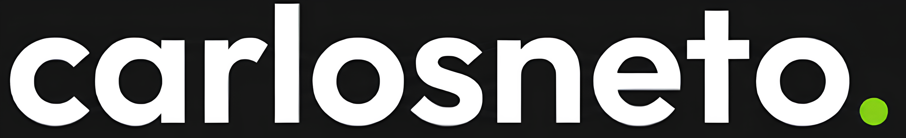
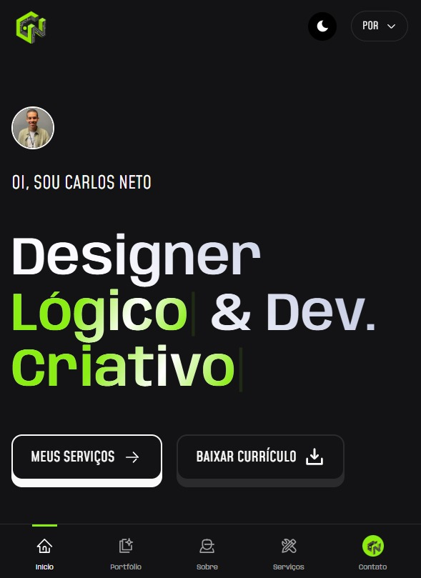

<div align="center">
  <br />
    <p align="center">
    
    
  </p>

  <h3 align="center">
    Developer Fullstack & Designer
  </h3>
  
  <p align="center">
    Especialista em criar experiências digitais únicas
  </p>

  <p align="center">
    
    
  </p>

  <br />

  <p align="center">
    <a href="#-sobre-o-projeto">Sobre</a> •
    <a href="#-funcionalidades">Funcionalidades</a> •
    <a href="#-tecnologias">Tecnologias</a> •
    <a href="#-layout--design">Design</a> •
    <a href="#-arquitetura-do-projeto">Arquitetura</a> •
    <a href="#-como-rodar">Instalação</a> •
    <a href="#-autor">Autor</a>
  </p>
</div>

---

## 📖 Sobre o Projeto

O **Portfolio-CN** é a minha vitrine digital pessoal, projetada para transcender o conceito de um simples currículo online. 

> **Decisão Estratégica**: Para este projeto, optei pelo framework **Nuxt 3**. A escolha foi fundamentada na necessidade de um desempenho excepcional (SSR), SEO otimizado nativamente e uma estrutura robusta que permite escalar funcionalidades mantendo a agilidade do Vue.js. É a ferramenta ideal para quem busca o equilíbrio perfeito entre velocidade de desenvolvimento e qualidade final do produto.

Ele representa a convergência entre o pensamento lógico do desenvolvedor e a sensibilidade estética do designer, focado em apresentar projetos de alto impacto, habilidades técnicas consolidadas e uma identidade visual proprietária.

### 🚀 Diferenciais

- **Performance de Elite**: Otimização de imagens e carregamento sob demanda para uma experiência instantânea.
- **Arquitetura Modular**: Componentização avançada utilizando as melhores práticas do Nuxt 3.
- **Narrativa Visual**: Uso estratégico de animações (GSAP) para guiar o olhar do visitante e contar uma história.
- **Multilíngue**: Suporte nativo para Português e Inglês, expandindo o alcance do portfólio.
- **Máxima Responsividade**: Layout fluído que se adapta perfeitamente de smartwatches a monitores ultra-wide.
- **Foco em Interatividade**: Micro-interações pensadas para tornar a navegação intuitiva e prazerosa.

---

## 🖼️ Demonstração

<div align="center">
  
</div>

---

## 🧩 Funcionalidades

- **👤 Apresentação Profissional**: Narrativa focada em experiência e storytelling para gerar conexão imediata.
- **💼 Showcase de Projetos**: Galeria interativa com detalhes técnicos, visuais e links diretos.
- **🌓 Dark & Light Mode**: Adaptação dinâmica à preferência do usuário, garantindo conforto visual em qualquer ambiente.
- **🌍 Internacionalização (i18n)**: Suporte nativo para Português e Inglês.
- **📱 Responsividade Total**: Experiência impecável em qualquer dispositivo (Mobile first).
- **✨ Animações Premium**: Transições suaves e micro-interações via GSAP e Motion.
- **🔍 SEO & Acessibilidade**: Otimizado para motores de busca e leitores de tela.
- **📈 Analytics Integrado**: Monitoramento de performance e tráfego via GTM e Speed Insights.

---

## 🛠️ Tecnologias Utilizadas

### **Front-end & Core**
<p align="left">
  
</p>

### **Estilização & Design**
<p align="left">
  
</p>

### **Bibliotecas & Ferramentas**
<p align="left">
  
  
  
</p>

### **Deploy & infra**
<p align="left">
  
</p>

---

## 🎨 Layout & Design

O conceito visual baseia-se no **Minimalismo High-Tech**. A tipografia foi escolhida para garantir legibilidade e autoridade, enquanto a paleta de cores foca no contraste acentuado (especialmente no modo escuro) para destacar o conteúdo dos projetos.

- **Identidade Visual**: Logotipo minimalista que reflete precisão e modernidade.
- **UX/UI**: Cada elemento foi posicionado para reduzir a carga cognitiva, permitindo que recrutadores e clientes encontrem informações cruciais em segundos.
- **Consistência**: Uso rigoroso de variáveis SCSS para manter a harmonia em todas as páginas e componentes.

---

## 🏗️ Arquitetura do Projeto

A estrutura foi organizada seguindo os padrões do Nuxt 3, priorizando a separação de responsabilidades e a escalabilidade:

```text
Portfolio-CN/
├── assets/             # Estilização global, SCSS e ícones customizados
├── components/         # Componentes Vue reutilizáveis (Atoms, Molecules, Organisms)
├── layouts/            # Templates estruturais das páginas
├── locales/            # Arquivos de tradução (i18n) para multi-idioma
├── pages/              # Estrutura de rotas baseada em arquivos
├── public/             # Ativos estáticos (Imagens, PDF, Favicon)
├── localData/          # Dados estáticos consumidos pela aplicação
├── server/             # Lógica de servidor e API routes (se aplicável)
├── app.vue             # Componente raiz da aplicação
├── nuxt.config.js      # Configurações globais do framework
└── package.json        # Dependências e scripts do projeto
```

---

## 💻 Como Rodar o Projeto Localmente

### Pré-requisitos
- [Node.js](https://nodejs.org/) (v18.0.0 ou superior)
- [NPM](https://www.npmjs.com/) ou [Yarn](https://yarnpkg.com/)

### Instalação

1. Clone o repositório:
   ```bash
   git clone https://github.com/Carlos2505dev/webportfolio-Carlos.git
   ```

2. Entre no diretório do projeto:
   ```bash
   cd Portfolio-CN
   ```

3. Instale as dependências:
   ```bash
   npm install
   ```

4. Inicie o servidor de desenvolvimento:
   ```bash
   npm run dev
   ```

O site estará disponível em `http://localhost:3000`.

---

## 🧠 Aprendizados

Durante o desenvolvimento deste projeto, aprofundei conhecimentos em:
- **Nuxt 3 Ecosystem**: Domínio da Composition API e SSR (Server Side Rendering) para máxima performance.
- **GSAP Orchestration**: Criação de timelines complexas e scroll-triggered animations que elevam a percepção de valor do site.
- **i18n Management**: Estruturação de tradução dinâmica, permitindo que o portfólio fale a língua do cliente/recrutador.
- **Arquitetura de Design System**: Criação de tokens de cor e tipografia reutilizáveis via SCSS, facilitando a manutenção e consistência.
- **Foco em Conversão (UI/UX)**: Implementação de call-to-actions estratégicos e hierarquia de informação otimizada.

---

## Próximos Passos

- [ ] **Otimização de Asset Loading**: Implementar carregamento progressivo de imagens (blur-up).
- [ ] **Seção de FAQ/Dúvidas**: Para pré-vender serviços de consultoria de forma automatizada.
- [ ] **Integração com Strapi**: Migrar dados estáticos para um CMS, facilitando atualizações de projetos.
- [ ] **Core Web Vitals**: Refinamento final para atingir score 100/100 em todas as métricas do Lighthouse.

---

## 👨‍💻 Autor

<div align="left">
  
  <br />
  <strong>Carlos Neto</strong>
  <br />
  Developer Fullstack & UI/UX Designer | Transformando linhas de código em experiências memoráveis.
  <br />
  
</div>

[](https://www.linkedin.com/in/carlosbezerraneto/)
[](https://github.com/Carlos2505dev)

---

<div align="center">
  <sub>Construído por <a href="https://github.com/Carlos2505dev">Carlos Neto</a></sub>
</div>
